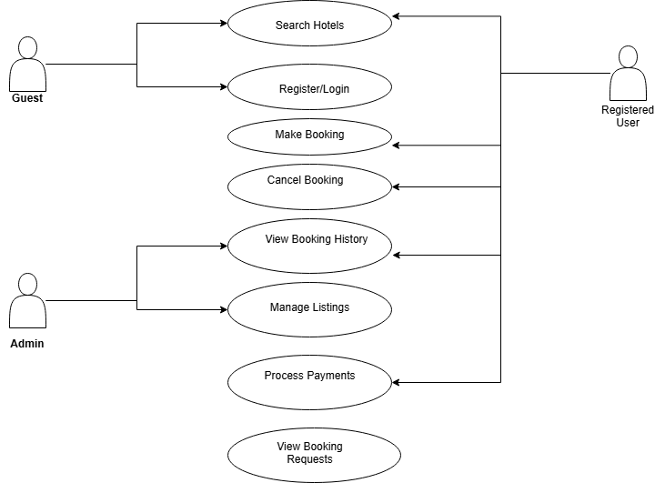

# Requirement Analysis in Software Development

Welcome to the **Requirement Analysis in Software Development** repository. This project explores how to define, document, and validate software requirements — a key step in building reliable, user-centered systems.

This repository provides resources and examples covering the entire requirement analysis process, including:
- Gathering and eliciting requirements
- Documenting functional and non-functional requirements
- Modeling with use case diagrams
- Defining clear acceptance criteria

It serves as a guide for developers, analysts, and learners interested in mastering the foundation of great software planning.

## What is Requirement Analysis?

Requirement Analysis is a critical phase in the Software Development Life Cycle (SDLC) that involves identifying, gathering, analyzing, and documenting the needs and expectations of stakeholders for a software product.

It ensures that all stakeholders — including clients, users, and the development team — have a shared understanding of what the system should do and how it should perform. This step is crucial before any design, development, or testing activities begin.

### Why is Requirement Analysis Important?

- **Clarity and Understanding:** It eliminates ambiguity by clearly stating what the software must achieve.
- **Scope Definition:** Defines what is included in the project and helps prevent scope creep.
- **Foundation for Design and Development:** Acts as the blueprint for system architecture and coding.
- **Accurate Estimations:** Supports better planning for timelines, costs, and resources.
- **Quality Assurance:** Helps ensure that the final product meets user expectations, leading to higher satisfaction.

By performing proper requirement analysis, development teams can avoid rework, reduce costs, improve efficiency, and deliver a product that aligns with stakeholder goals.

## Why is Requirement Analysis Important?

Requirement Analysis plays a vital role in the success of any software development project. Here are key reasons why it is essential in the Software Development Life Cycle (SDLC):

1. **Clear Understanding of Stakeholder Needs**  
   It ensures that all stakeholders, including clients, users, and developers, have a common and accurate understanding of what the software should do. This clarity minimizes miscommunication and helps align the development process with business goals.

2. **Accurate Project Planning and Estimation**  
   With well-defined requirements, the team can better estimate the time, cost, and resources needed for development. This helps avoid unexpected delays, budget overruns, and resource misallocation.

3. **Foundation for System Design and Development**  
   Requirement analysis acts as the foundation for the system's architecture and design. It guides developers on how the system should behave and perform, ensuring the end product meets expectations.

4. **Prevention of Scope Creep**  
   Clearly defined and documented requirements help prevent scope creep — the uncontrolled expansion of project scope — by setting boundaries and expectations early on.

5. **Improved Quality and Customer Satisfaction**  
   When requirements are thoroughly analyzed and validated, the final product is more likely to meet user needs, resulting in higher quality and improved customer satisfaction.

## Key Activities in Requirement Analysis

Requirement Analysis involves several key activities that ensure the software being developed meets user needs and business objectives. Below are the five core activities:

- **Requirement Gathering 🗂️**  
  Collecting raw data about user needs through:
  - Interviews with stakeholders
  - Surveys or questionnaires
  - Workshops and focus groups
  - Observation of user workflows
  - Reviewing existing documents and systems

- **Requirement Elicitation ✍️**  
  Refining gathered data to uncover detailed and relevant requirements by:
  - Brainstorming with stakeholders and team members
  - Conducting focus group discussions
  - Building and testing prototypes for early feedback

- **Requirement Documentation 📚**  
  Structuring and recording requirements clearly using:
  - Requirement Specification Documents (RSD)
  - User stories that capture needs from the user’s perspective
  - Use case diagrams to show interactions between users and the system

- **Requirement Analysis and Modeling 📊**  
  Making sense of the documented requirements by:
  - Prioritizing based on business value and technical feasibility
  - Performing feasibility analysis (technical, financial, legal)
  - Creating visual models such as data flow diagrams and ER diagrams

- **Requirement Validation ✅**  
  Ensuring all requirements are correct, complete, and approved by:
  - Conducting stakeholder reviews and walkthroughs
  - Defining clear acceptance criteria
  - Using traceability matrices to track requirements through development
 
## Types of Requirements

In software development, requirements are broadly categorized into two types: **Functional Requirements** and **Non-functional Requirements**. Both are crucial for the successful design and implementation of a system.

### Functional Requirements

Functional requirements define the specific behavior or functions of a system. They describe what the system should do.

**Examples in a Hotel Booking Application:**

- **User Registration and Authentication:** Users can create accounts and log in securely.
- **Search Functionality:** Users can search for hotels based on location, availability, price, and amenities.
- **Booking Management:** Users can book rooms, view booking details, and cancel reservations.
- **Payment Processing:** Users can make payments through integrated payment gateways.
- **Hotel Management Portal:** Hotel owners can add, update, or remove hotel listings and manage bookings.

### Non-functional Requirements

Non-functional requirements specify the criteria that judge the operation of a system, rather than specific behaviors.

**Examples in a Hotel Booking Application:**

- **Performance:** The system should handle a high number of concurrent users without performance degradation.
- **Scalability:** The application should scale horizontally to accommodate increasing user loads.
- **Availability:** The system should have minimal downtime, ensuring users can access services at all times.
- **Security:** User data should be protected through encryption and secure authentication mechanisms.
- **Usability:** The application should have an intuitive interface, providing a seamless user experience.

## Use Case Diagrams

Use Case Diagrams are visual representations that illustrate how users (actors) interact with a system to achieve specific goals (use cases). These diagrams help stakeholders understand the functional scope of the system at a glance.

### Benefits of Use Case Diagrams
- Provide a clear overview of system functionalities.
- Identify all types of users interacting with the system.
- Serve as a communication tool between technical and non-technical stakeholders.
- Help define system boundaries and user goals.

### Example: Hotel Booking System Use Case Diagram

The following diagram illustrates the key actors and their interactions with the system:

 # Acceptance Criteria

## Importance of Acceptance Criteria in Requirement Analysis:

Acceptance Criteria are critical in ensuring that the software meets the stakeholders' expectations and functions as required. They serve as specific conditions or requirements that a feature must meet for it to be considered complete and ready for release. Defining clear and measurable acceptance criteria provides the following benefits:

- **Clarity and Understanding:** Acceptance criteria ensure that both the development team and stakeholders have a mutual understanding of the feature’s expected behavior.
- **Testability:** They serve as a foundation for writing test cases, ensuring that each feature is thoroughly tested and validated before it’s considered finished.
- **Quality Assurance:** Clear acceptance criteria help maintain high standards of quality by ensuring that all required functionality is present and performing as expected.
- **Scope Control:** By defining what is required, acceptance criteria prevent scope creep and ensure that the development stays on track, without introducing unnecessary features.

Incorporating acceptance criteria into the requirement analysis process enables precise measurement of whether the developed software meets its defined requirements and fulfills user needs.

## Example of Acceptance Criteria for a Checkout Feature in the Booking Management System:

Let’s define acceptance criteria for a **Checkout** feature in the context of a booking management system.

**Feature:** Checkout Process for Booking Confirmation

### Acceptance Criteria:

1. **Availability of Properties:**
   - The system must display available properties for the selected dates.
   - If no properties are available for the selected dates, the user must be notified with an appropriate message (e.g., "No properties available for your selected dates").

2. **User Login or Registration:**
   - The user must be able to either log in to their account or register as a new user before proceeding to checkout.
   - If the user is not logged in, they should be prompted to log in or create an account.

3. **Selection of Payment Method:**
   - The user should be able to select from available payment methods (e.g., credit card, PayPal, etc.).
   - Payment options should be displayed clearly, and the user should receive a confirmation message once the payment method is selected.

4. **Payment Processing:**
   - The system must process the payment securely and notify the user of a successful payment or failure.
   - If the payment is declined, the user should be presented with a clear error message and offered an opportunity to retry or select a different payment method.

5. **Booking Confirmation:**
   - After successful payment, the system should generate a booking confirmation with the booking details (e.g., property name, check-in/check-out dates, total price).
   - The user should receive a booking confirmation email within 2 minutes of completing the payment.

6. **Booking Cancellation:**
   - The user must be able to cancel the booking from their account page within a specified time frame (e.g., 24 hours before check-in) and receive a full refund.
   - If the cancellation occurs after the specified time frame, a cancellation fee should apply, and the user must be informed about the fee.

